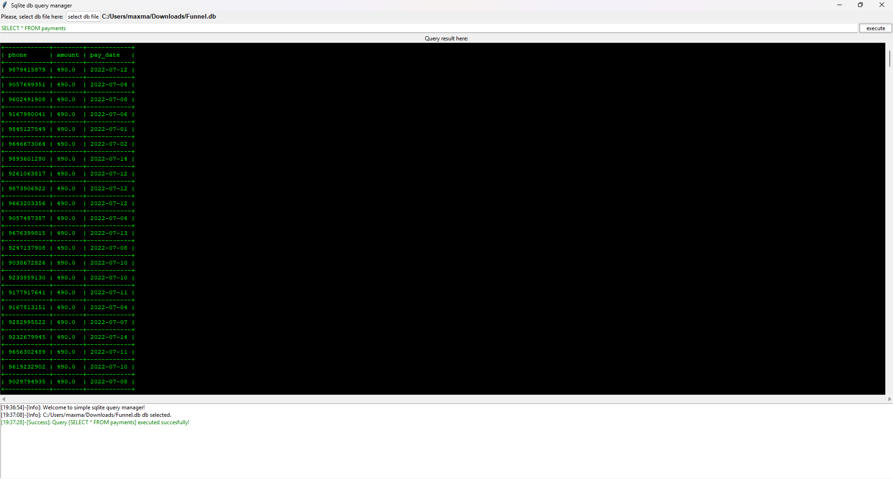

# Simple-SQlite-Query-Manager
🖥️A simple GUI SQlite query manager built in tkinter

| Demo screen |
| :----------------|
|  |
| <a href="previews/preview.png">See demo screen</a> |

# Utility setup

## 🖥️Clone this repo:
    git clone https://github.com/Maxdgf/Simple-SQlite-Query-Manager.git

## 🕹️Go to cloned repo:
    cd Simple-SQlite-Query-Manager

## 📃Install important libs:
    pip install -r requirements.txt

## 🔌Launch utility:
    python sqlite_query_manager.py
