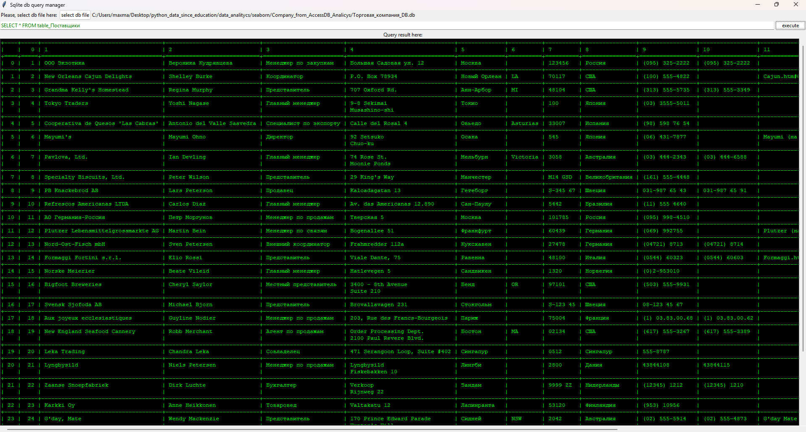

# Simple-SQlite-Query-Manager
🖥️A simple GUI SQlite query manager built in tkinter

| Demo screen |
| :----------------|
|  |
| <a href=".github/bd_screen.png">See demo screen</a> |

## 📃Install important libs:
##
    pip install -r requirements.txt
